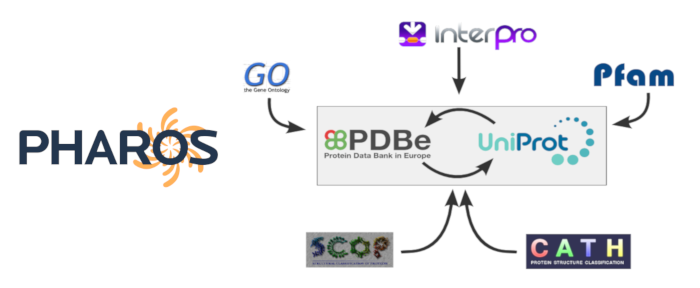

# Mapping Pharos Targets to PDB IDs

The Structure Integration with Function, Taxonomy and Sequence (SIFTS) database provides mappings between UniProt and PDB, as well as annotations from IntEnz, GO, InterPro, Pfam, CATH, SCOP, PubMed, Ensembl and Homologene resources. Here, we map all the receptors from the Pharos database to their PDB IDs, using their UniProt accession numbers.

The goal is to obtain a dataset of human targets with available structures and known ligand binding affinities. We also aim to obtain a characterizaton of the distribution of these PDB structures across different receptor families, such as Kinases, GPCRs, Ion Channels, Nuclear Receptors, and Transporters.

This repository contains datasets of Pharos targets in the Tchem and Tclin classes, and Jupyter notebooks for generating their PDB mappings.
